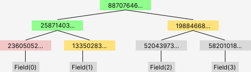

# (very basic) Merkle Tree implementation for SnarkyJS

## Description

A<a href="https://en.wikipedia.org/wiki/Merkle_tree" target="_blank"> Merkle Tree</a> is a binary tree in which the leaf nodes consist of the hashes of the underlying data. The inner nodes are the hashed concatenation of the hash values of the two child nodes $hash_{parent} = H(left | right)$ where $H$ is a one-way hash function, in this case Mina's SnarkyJS implementation of [Poseidon](https://www.poseidon-hash.info/). A Merkle Tree allows for efficient verification that some data exists within a larger data structure, also called `proof of inclusion`.

<br/><br/>



<br/><br/>

The image above shows an example Merkle Tree with four leaves. If one wanted to proof the inclusion of data with the hash `23605052...` (in red), one could simply construct the Merkle Path which leads to the root hash of the Merkle Tree. For a Merkle Proof for the leaf `23605052...` (red), the nodes with hash `13350283...` and `19884668` (yellow) are required in order to sucessfully construct a Merkle Proof.

## Use Case

A possible use case for Merkle Trees in zkApps on Mina are, for example, including (and proving the existance) of some off-chain data storage.

## Usage

```ts
import { Field, isReady, Poseidon, shutdown } from 'snarkyjs';
import { MerkleTree, Options } from './MerkleTree.js';

const example = async () => {
  await isReady;

  // Options that can be passed into the Merkle Tree
  let options: Options = {
    hashLeaves: true, // if true, elements will be hashed before insertion
  };

  // example data, see description above!
  let rawData: Field[] = [Field(0), Field(1), Field(2), Field(3)];

  // create a new Merkle Tree
  let tree = new MerkleTree(rawData, options);

  // print the root of the tree
  console.log('root: ' + tree.getMerkleRoot()?.toString());

  // print the merkle proof for leaf at index 0
  tree.printProof(0);

  // print the tree structure
  tree.printTree();

  /* verify if an element exists within a merkle tree, by passing in 
    - a merkle proof
    - the hash of the leaf that you want to verify
    - the merkle root 
  */
  let isValid = MerkleTree.validateProof(
    tree.getProof(0),
    Poseidon.hash([rawData[0]]),
    tree.getMerkleRoot()!
  );
  console.log('proof valid?', isValid);
  shutdown();
};
example();
```

## Disclaimer and Notes

Using a `MerkleProof` _within_ a zkApp might not work currently, because dynamic-size arrays aren't supported yet. To fix that, you would have to define a static-sized array with a pre-defined size and pad the rest of the Merkle Proof in order to use it within zkApps. I plan on adding sized-trees to make that work without having to pad the proof array.

_Do not_ use for anything important, the implementation hasn't been audited.
